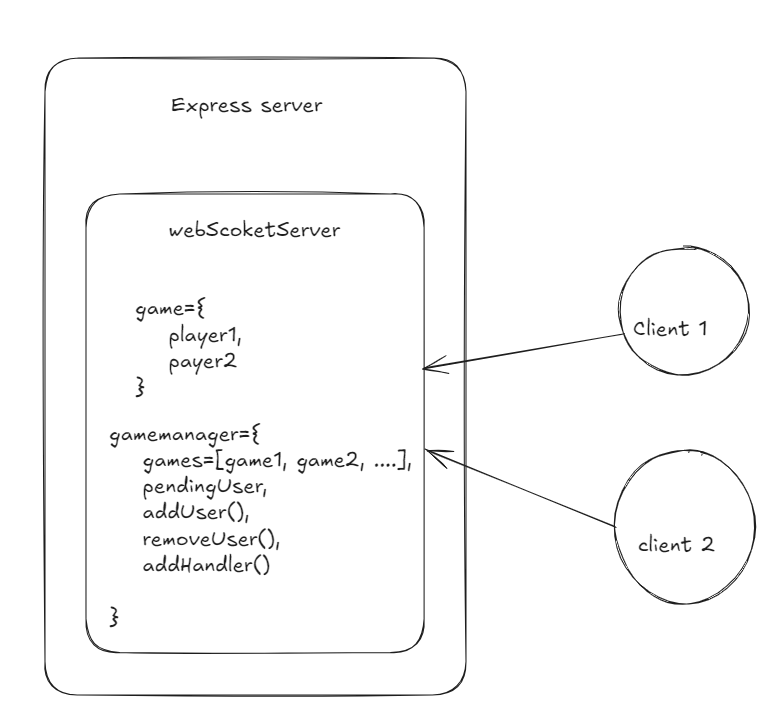

# Chess Game

A web-based multiplayer chess game built with React and JavaScript, using MongoDB, Express.js, WebSocketServer for real-time updates, and Material-UI for styling. Move validation is handled using the `chess.js` library.

## Features
<ul>
	<li><strong>Real-time updates</strong>: Moves are updated in real-time using WebSockets.</li>
	<li><strong>Move validation</strong>: Validates all moves using `chess.js` to ensure they comply with chess rules.</li>
</ul>

## Tech Stack

-   **Frontend**: React, Material-UI
-   **Backend**: Node.js, Express.js
-   **Database**: MongoDB
-   **Real-Time**: WebSocketServer
-   **Move Validation**: chess.js.

## Installation
To run this project locally, follow these steps:
	
 	0. Install vite
		npm install vite
	1. Clone the repository:
		https://github.com/jeevanbabu7/chess-game.git

	2. Navigate to the project directory:
		cd chess-game
		
	3. Install the dependencies for both frontend and backend:
		cd client
		npm install
		cd ../server
		npm install
	4. Set up environment variables:
		- Create a `.env` file in the `server` directory.
		- Add the following variables: 
			- DB_STR=<your-mongo-uri>
			- JWT_SECRET=<key to generating jwt tokens>
	
	5. Start the application:
		// Start the backend cd server npm start:
			cd backend1
			npm start
		// In another terminal, start the frontend
			cd frontend
			npm run dev
	6. Open your browser and go to `http://localhost:5173'

### Backend architecture

# Future improvements

**AI Opponent**: Implement an AI for players to compete against when no other online players are available. 
**Spectator Mode**: Allow users to watch live games between other players. 
**Game Analysis & Free Review**:

-   Introduce a **game review** feature similar to Chess.com, allowing players to analyze their games after completion.
-   Show the best, good, and blunder moves for each turn, and provide suggestions for improvement.
-   Include a move-by-move analysis, showing potential winning strategies and key turning points.
-   Offer the **review feature for free**, letting players improve their chess skills by reviewing their gameplay without needing a subscription. 

<strong> Sharable Game Links</strong>:  Allow players to generate a link that they can send to friends to invite them to join and play a game directly.
